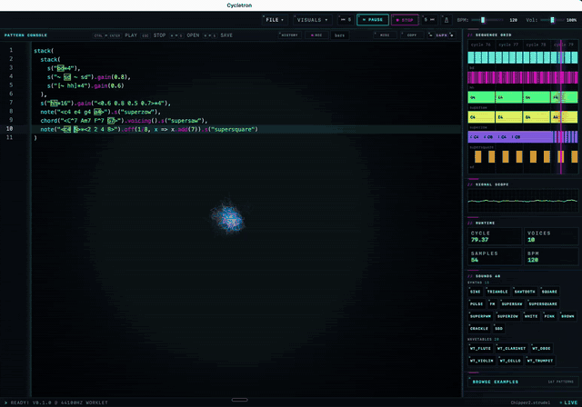

# Cycletron

**Live coding for music, built on Rust** — a fast native desktop instrument.

A [NaderLabs](https://www.naderlabs.io/) project · by [@nukleas](https://github.com/nukleas)

[](https://github.com/nukleas/cycletron/actions/workflows/ci.yml)
[](LICENSE)
[](https://github.com/nukleas/cycletron/releases)

> Patterns run on **strudel-rs** (Rust). The dialect is Strudel-compatible mini-notation. Cycletron is not affiliated with strudel.cc.



▶ **[Watch the full 3-minute demo](https://github.com/nukleas/cycletron/releases/download/v0.1.0-alpha.6/cycletron-demo-v0.1.0-alpha.6.mp4)** — sound on.

---

## What it is

Cycletron is a Tauri v2 desktop app: a live-coding REPL on a pure-Rust audio
engine (compiled to WASM — no JS in the signal path), with a file library,
MIDI tools, music-reactive visuals, and an optional AI co-pilot.

- **Play** — evaluate patterns in the editor (⌘↩), transport, BPM, visuals;
  edits hot-swap on the next eval with no compile step
- **MIDI** — file import, MIDI Lab conversion, play-in capture (record a phrase
  from your controller into a pattern), CC mapping, learnable pads
- **Library** — save patterns, recents, snapshots, export to WAV / stems / MIDI
  (MP3 needs `ffmpeg` on PATH)
- **AI-friendly** (opt-in, off by default) — Claude / Grok / OpenAI / Codex, or
  any OpenAI-compatible endpoint (Ollama, LM Studio — local models without
  tool-calling can chat but can't drive the audio)

---

## Status

**Public alpha** (`0.1.0-alpha`). It works — expect rough edges. The supported
DSL is a documented subset of web Strudel (see below); issues and patterns are
welcome.

- **User guide:** [`docs/USER_GUIDE.md`](docs/USER_GUIDE.md) (also Help → User Guide in-app)
- **Dialect footguns:** [`docs/DIALECT.md`](docs/DIALECT.md) (Help → Cycletron Dialect)
- **Supported DSL:** [`docs/STRUDEL_RS_SUPPORTED.md`](docs/STRUDEL_RS_SUPPORTED.md)

---

## Install

Grab the latest build from [**Releases**](https://github.com/nukleas/cycletron/releases):

| Platform | Artifact | Notes |
|----------|----------|-------|
| macOS (Intel + Apple Silicon) | `.dmg` | signed + notarized universal build |
| Linux | `.AppImage` / `.deb` / `.rpm` | |
| Windows | `.exe` (NSIS) | unsigned for now — SmartScreen: *More info → Run anyway* |

Or build from source (below).

---

## Requirements (dev)

- Rust (edition 2024 toolchain as in workspace)
- Node.js 22+ and npm (UI)
- Tauri CLI: `cargo install tauri-cli --version "^2"`
- Linux only: the system packages CI installs (webkit2gtk, gtk3, soup3,
  appindicator, librsvg, alsa, udev — see `.github/workflows/ci.yml`)
- Optional: AI provider — Preferences → AI (SuperGrok OAuth, Codex/ChatGPT OAuth, or API keys / env: `ANTHROPIC_API_KEY` / `XAI_API_KEY` / `OPENAI_API_KEY`)

The **strudel-rs** engine is a pinned git dependency (Codeberg), and the prebuilt
audio WASM is committed under `ui/pkg`, so a fresh clone builds with no sibling
checkout and no nightly toolchain:

```bash
# from this repo root — installs UI deps, starts Vite + app
cargo tauri dev
```

`beforeDevCommand` runs `npm install` then the Vite dev server under `ui/`.
You should not need a separate `cd ui && npm install` for a fresh clone.

```bash
cargo tauri build             # production bundle (npm install + vite build first)
```

### Bumping the engine

Only needed when moving to a newer strudel-rs. Update the pinned `rev` for the
`strudel-*` / `midi-to-strudel` git deps in the workspace `Cargo.toml`, then
rebuild and re-commit the audio WASM (needs nightly + `wasm-pack`). The
`build:wasm` script expects a strudel-rs checkout at that rev as a sibling dir
(`../strudel-rs/` relative to this repo) — adjust the path in `ui/package.json`
if yours differs:

```bash
cd ui && npm run build:wasm   # rebuild strudel-audio-wasm → ui/pkg, then commit ui/pkg
```

---

## License

**AGPL-3.0-or-later** — see [`LICENSE`](LICENSE), [`NOTICE`](NOTICE), and workspace `Cargo.toml`.

Cycletron builds on and adapts **Strudel** ([codeberg.org/uzu/strudel](https://codeberg.org/uzu/strudel))
and **strudel-rs** ([codeberg.org/nukleas/strudel-rs](https://codeberg.org/nukleas/strudel-rs)),
both AGPL-3.0-or-later — see [`NOTICE`](NOTICE). The prebuilt engine WASM in `ui/pkg/`
is an AGPL binary; its corresponding source (AGPL §6) is strudel-rs at the `rev`
pinned in the workspace `Cargo.toml`. Bundled third-party audio (samples,
drum machines, soundfonts) is credited in [`ATTRIBUTION.md`](ATTRIBUTION.md).

## Privacy

AI features are **off until you enable them** — Cycletron is a fully usable
live-coding instrument without any provider configured. When enabled, prompts
and pattern text go to the AI provider you choose. API keys stay in the
local secrets store (keychain in release builds). SuperGrok / Codex OAuth tokens
live in app data (`xai-oauth.json`, `codex-oauth.json`, owner-only file
permissions on macOS/Linux). Logs and agent stats remain on this machine.
The only other network request is the startup update check against GitHub
Releases — it can be turned off in Preferences → Updates.

## Releasing

See [`docs/RELEASE.md`](docs/RELEASE.md) (updater keys, signing, CI, tags).

---

## Links

| | |
|--|--|
| Studio | [naderlabs.io](https://www.naderlabs.io/) |
| GitHub | [github.com/nukleas/cycletron](https://github.com/nukleas/cycletron) |
| Engine | [strudel-rs](https://codeberg.org/nukleas/strudel-rs) (pinned git dependency) |
